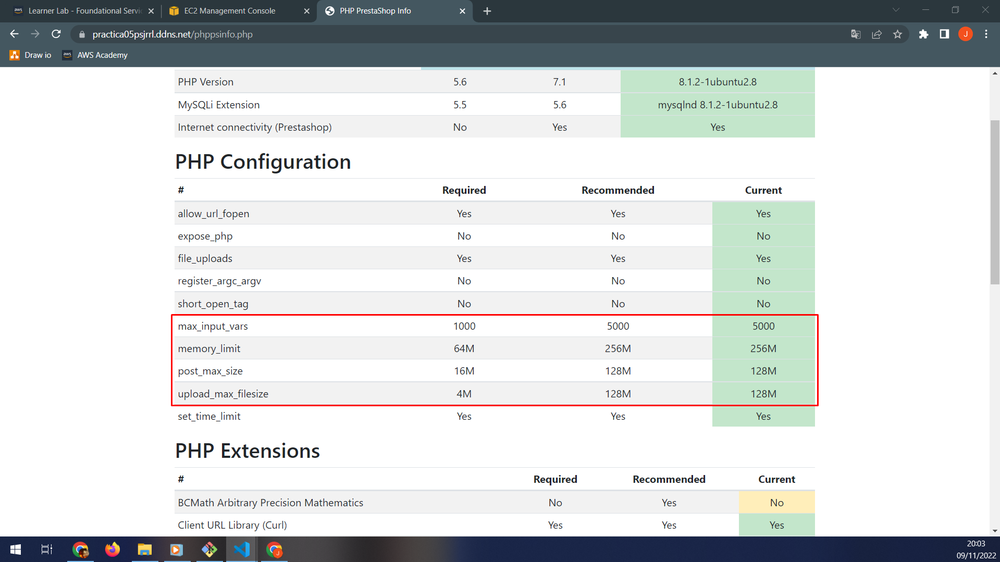
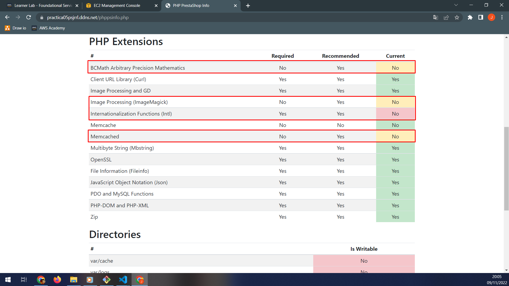
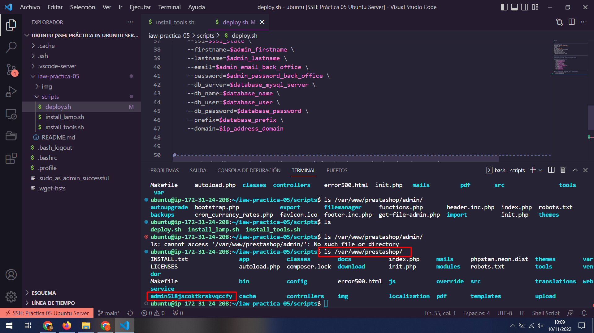
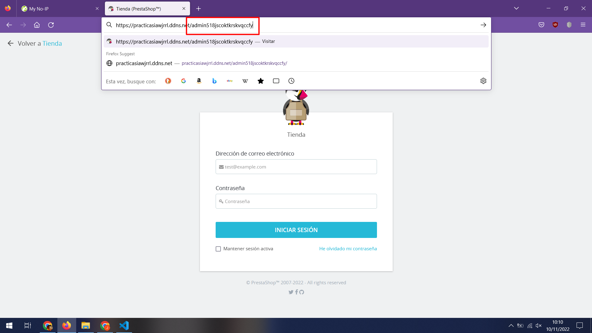
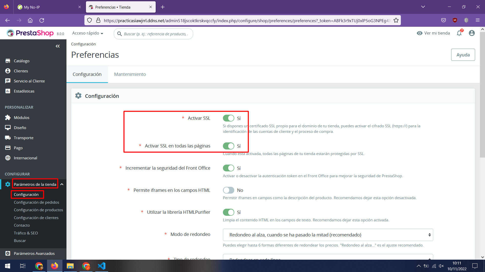
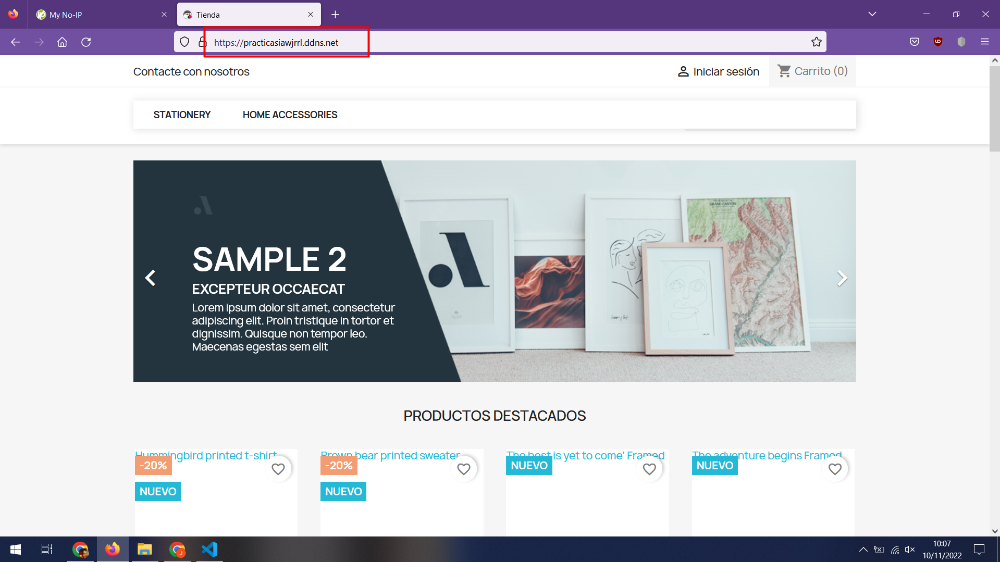

# iaw-practica-05

## Práctica 5 de IAW - Instalación de PrestaShop

Realizaremos la instalación y configuración de **PrestaShop** en **Ubuntu Server 20.04** con **al menos 2 GB de memoria RAM**, para ello, usaremos una instancia nueva y asignaremos una dirección IP elástica a la instancia, además de preparar un nombre de host a la dirección IP de la máquina mediante [No-IP](https://www.noip.com/es-MX).


A continuación prepararemos el repositorio, de forma que tenga la siguiente estructura:

+ Directorio del repositorio
    
    + scripts --> Directorio
        + install_lamp.sh --> Archivo
        + install_tools.sh  --> Archivo
        + deploy.sh --> Archivo
        + php_fix.php --> Archivo
    

Cuando tengamos la estructura creada, daremos permisos de ejecución al usuario propietario de los scripts, usaremos el comando **chmod** y lo modificaremos según la ruta en la que nos encontremos, salvo que accedamos directamente al directorio **scripts** como sería el caso:

> **chmod 744 \***

### Preparación de install_lamp.sh

Procederemos a añadir los comandos necesarios para realizar la instalación de la pila LAMP en la instancia. Necesitaremos Apache, MySQL / MariaDB y PHP, como hemos usado esta estructura en prácticas anteriores, no hace falta explicar que hace cada una.

Añadiremos el siguiente contenido al script:

```bash
#!/bin/bash

set -x

apt-get update

apt-get upgrade -y

apt-get install apache2 -y

apt-get install mysql-server -y

apt-get install php libapache2-mod-php php-mysql -y
```

En cuanto tengamos el script, podemos ejecutarlo usando:

> **sudo sh install_lamp.sh**

O

> **sudo ./install_lamp.sh**

Deberemos tener en cuenta la ruta en la que estamos para ello.

### Preparación de install_tools.sh

Prepararemos la primera parte del script que nos servirá para definir variables locales que nos servirán más adelante y preparar el sistema haciendo varias instalaciones.

#### Preparación del script mediante variables e instalación de Unzip

```bash
#!/bin/bash

set -x

PHPMYADMIN_APP_PASSWORD=phpmyadmin_password

database_prestashop=DB_PrestaShop
database_user=Usuario_PrestaShop
database_password=Password_PrestaShop

apt-get install unzip -y
```

La variable **PHPMYADMIN_APP_PASSWORD** nos permite guardar la contraseña para phpMyAdmin y poder usarla para crear una base de datos, con un usuario y una contraseña para esa base de datos. Las demás variables nos sirven para establecer los parámetros de la creación de la base de datos junto a usuario y contraseña. Después realizaremos la instalación de **Unzip** para descomprimir paquetes en formato **.zip**.

#### Preparación e instalación de phpMyAdmin junto a creación de una base de datos

```bash
echo "phpmyadmin phpmyadmin/reconfigure-webserver multiselect apache2" | debconf-set-selections
echo "phpmyadmin phpmyadmin/dbconfig-install boolean true" | debconf-set-selections
echo "phpmyadmin phpmyadmin/mysql/app-pass password $PHPMYADMIN_APP_PASSWORD" | debconf-set-selections
echo "phpmyadmin phpmyadmin/app-password-confirm password $PHPMYADMIN_APP_PASSWORD" | debconf-set-selections

apt install phpmyadmin -y

echo "DROP DATABASE IF EXISTS $database_prestashop;" | mysql -u root
echo "CREATE DATABASE $database_prestashop CHARSET utf8mb4;" | mysql -u root
echo "USE $database_prestashop;" | mysql -u root

echo "CREATE USER IF NOT EXISTS '$database_user'@'%' IDENTIFIED BY '$database_password';" | mysql -u root
echo "GRANT ALL PRIVILEGES ON $database_prestashop.* TO '$database_user'@'%';" | mysql -u root
```

Con los primeros cuatro **echo** "importaremos" la configuración necesaria para pasar mediante **pipe** o **tubería** la configuración a **debconf-set-selections** y realizar una instalación desatendida de **phpMyAdmin**. Después instalaremos phpMyAdmin usando los parámetros anteriores. Importaremos la base de datos dando la configuración que creamos conveniente usando las variables locales que hemos establecido al principio.

### Preparación de Certbot

```bash
snap install core

snap refresh core

apt-get remove certbot

snap install --classic certbot

ln -s /snap/bin/certbot /usr/bin/certbot

mkdir -p /var/www/prestashop
```

Realizaremos la instalación del cliente de Certbot para obtener un certificado SSL /TLS en nuestro servidor. Por último de este script, crearemos el directorio que contendrá PrestaShop en **/var/www**.

### Preparación de php_fix.sh

```bash
mkdir -p /tmp/php-ps-info

wget -P /tmp/php-ps-info https://github.com/PrestaShop/php-ps-info/archive/refs/tags/v1.1.zip

unzip /tmp/php-ps-info/v1.1.zip -d /tmp/php-ps-info

mv /tmp/php-ps-info/php-ps-info-1.1/phppsinfo.php /var/www/prestashop

rm -rf /tmp/php-ps-info
```

Antes de instalar PrestaShop, veremos los requisitos que necesitamos para que funcione correctamente. Crearemos un directorio en **/tmp** que alojará el archivo comprimido y dos archivos más. Después descargaremos el archivo comprimido y descomprimiremos su contenido en el mismo directorio de descarga, moveremos el archivo **phppsinfo.php** que está en **/tmp/php-ps-info/php-ps-info-1.1** y lo movemos a **/var/www/prestashop**. Borraremos el directorio que hemos creado en **/tmp**.

```bash
sed -i "s/;max_input_vars = 1000/max_input_vars = 5000/" /etc/php/7.4/apache2/php.ini

sed -i "s/memory_limit = 128M/memory_limit = 256M/" /etc/php/7.4/apache2/php.ini

sed -i "s/post_max_size = 8M/post_max_size = 128M/" /etc/php/7.4/apache2/php.ini

sed -i "s/upload_max_filesize = 2M/upload_max_filesize = 128M/" /etc/php/7.4/apache2/php.ini

apt install php-bcmath php-imagick php-intl php-memcached php-mbstring php-zip php-gd php-json php-curl -y

mkdir -p /var/www/prestashop/app/Resources/translations

a2enmod rewrite

systemctl restart apache2
```

Estos comandos nos permiten cambiar ciertos parámetros de PHP, instalar varios módulos, crear un directorio que no viene creado en la instalación de PrestaShop, habilitar el módulo rewrite de Apache y el posterior reinicio del servidor web para aplicar los cambios realizados anteriormente.

#### Comprobación de los requisitos necesarios de PHP para PrestaShop

Mediante un navegador web accederemos mediante la dirección IP elástica de la instancia o usando el dominio que tenemos en **No-IP**, haciendo referencia al archivo **phppsinfo.php**. Tendremos que introducir un usuario y contraseña que se encuentra en el archivo **phppsinfo.php**, siendo **prestashop** tanto el usuario y la contraseña.


Veremos que hay unas **advertencias en color amarillo** que podemos dejar sin solucionar y **obligaciones en color rojo** que debemos solucionar. Como nos interesa que funcione correctamente, solucionaremos todo.

Empezaremos solucionando el apartado de **PHP Configuration**, para ello, tenemos que buscar en los archivos de configuración las líneas a solucionar. Accederemos al directorio donde se encuentra la configuración de PHP con el comando cd **/etc/php** y usaremos el comando **GREP** para buscar las líneas.


Buscaremos línea a línea, de forma que la sintaxis del comando será **grep max_input_vars \* -R**, buscaremos max_input_vars y que contenga cero o varios caracteres más mediante **el asterísco** y de forma recursiva desde el directorio en el que nos encontramos con el modificador **-R**. De esta forma buscaremos todas las líneas de **PHP Configuration**. Veremos que cada línea nos da dos archivos en los que se encuentra cada línea, en **7.4/cli/php.ini** y en **7.4/apache2/php.ini**. Nos interesa el archivo **7.4/apache2/php.ini**, por lo que será este el que modifiquemos. También nos da la línea completa que queríamos buscar de forma que primero es la ruta y el archivo separado con un **colon** o **puntos dobles** y la línea completa en el archivo.

En el primer **grep**, la línea es **;max_input_vars = 1000** debemos tener en cuenta el **semicolon** o **punto y coma** ya que es un comentario y hace que la línea no "exista" aunque esté en el archivo, de forma que ***tenemos que quitar el comentario y modificar el valor***. Las demás líneas no tienen problema de comentario, por lo que únicamente tenemos que cambiar el valor.


Usaremos el comando **SED** para modificar todas las líneas, con el modificador **-i** hacemos que el cambio se haga directamente en el archivo, para agrupar la órden, el patrón de búsqueda y el patrón de sustitución usaremos bien comillas dobles o comillas simples, y como delimitador entre la órden, el patrón de búsqueda y el patrón de sustitución podemos usar **slash** **/**, **backslash** **\\** o **hash** **#**.

La órden será la "**s**" para buscar y sustituir y el patrón de búsqueda será el resultado completo que nos ha dado el comando **GREP**, **;max_input_vars = 1000** y como patrón de sustitución pondremos la línea sin el comentario y el nuevo valor que nos indica en el navegador web, **max_input_vars = 5000**,  por último como será un comando del script, deberemos hacer referencia a la ruta completa del archivo, **/etc/php/7.4/apache2/php.ini**. Ejecutaremos el comando y comprobaremos que se ha cambiado correctamente. De esta forma, haremos los cambios a las demás líneas quedando así:

```bash
sed -i "s/;max_input_vars = 1000/max_input_vars = 5000/" /etc/php/7.4/apache2/php.ini

sed -i "s/memory_limit = 128M/memory_limit = 256M/" /etc/php/7.4/apache2/php.ini

sed -i "s/post_max_size = 8M/post_max_size = 128M/" /etc/php/7.4/apache2/php.ini

sed -i "s/upload_max_filesize = 2M/upload_max_filesize = 128M/" /etc/php/7.4/apache2/php.ini
```



Cuando se hayan realizado los cambios en el archivo, tendremos que reiniciar el servidor Apache para que se apliquen los cambios realizados, usaremos el comando **sudo systemctl restart apache2** y actualizaremos la página en el navegador web.



Una vez resuelta la configuración de PHP, pasaremos a la siguiente parte, **PHP Extensions**, hay algunas extensiones de PHP que he instalado anteriormente, por lo que vemos que hay varias extensiones realizaremos su instalación, la extensión **BCMath Arbitrary Precision Mathematics** y se instala como **php-bcmath**, la siguiente extensión es **Image Processing (ImageMagick)** y se instala como **php-imagick**, la extensión **Internationalization Functions (Intl)** se instala como **php-intl** y por último **Memcached** se instala como **php-memcached**.

En el script, las extensiones que tenemos que instalar son:

```bash
apt install php-bcmath php-imagick php-intl php-memcached php-mbstring php-zip php-gd php-json php-curl -y
```


Como hicimos con **PHP Configuration**, una vez hayamos instalado las extensiones, reiniciaremos el servicio de Apache y comprobaremos que están todas correctas.

**DATO**: La extensión **php-imagick** me da errores al realizar la instalación en **Ubuntu 22.04**, los mismos errores que da cuando se trata de realizar **upgrade** al sistema operativo, no permitiendo hacer una instalación desatendida.


En **Directories** nos indica que tenemos que hacer que los siguientes tengan permisos de escritura, también tendremos que crear el directorio **app/Resources/translations**, usaremos el comando **chmod -R +w var/cache var/logs img mails modules translations upload download app/config app/Resources/translations** para agregar el permiso de escritura a los directorios que nos indica.

Por último, habilitaremos el módulo **mod_rewrite** de Apache mediante el comando **a2enmod rewrite** y reiniciaremos el servicio de Apache.


El script deberá quedar de la siguiente manera:

```bash
mkdir -p /tmp/php-ps-info

wget -P /tmp/php-ps-info https://github.com/PrestaShop/php-ps-info/archive/refs/tags/v1.1.zip

unzip /tmp/php-ps-info/v1.1.zip -d /tmp/php-ps-info

mv /tmp/php-ps-info/php-ps-info-1.1/phppsinfo.php /var/www/prestashop

rm -rf /tmp/php-ps-info

sed -i "s/;max_input_vars = 1000/max_input_vars = 5000/" /etc/php/7.4/apache2/php.ini

sed -i "s/memory_limit = 128M/memory_limit = 256M/" /etc/php/7.4/apache2/php.ini

sed -i "s/post_max_size = 8M/post_max_size = 128M/" /etc/php/7.4/apache2/php.ini

sed -i "s/upload_max_filesize = 2M/upload_max_filesize = 128M/" /etc/php/7.4/apache2/php.ini

apt install php-bcmath php-imagick php-intl php-memcached php-mbstring php-zip php-gd php-json php-curl -y

mkdir -p /var/www/prestashop/app/Resources/translations

a2enmod rewrite

chown -R www-data:www-data /var/www/prestashop

systemctl restart apache2
```

Estos errores han sido específicos, por lo que hay que tratar de solucionar los que cada cual tenga en su servidor, pueden ser los mismos o distintos.

### Preparación de deploy.sh

Terminaremos con este último script que nos permite realizar la instalación de PrestaShop en el equipo.

#### Definición de variables locales

```bash
#!bin/bash

set -x

certbot_email=tetz_dqhwr17@yutep.com
certbot_domain=practicasiawjrrl.ddns.net

prestashop_language=es
prestashop_shop_name="Tienda PrestaShop JRRL"
prestashop_activity=7
country_code=es
ssl_state=1
admin_firstname="Juan Ramón"
admin_lastname="Rueda Lao"
admin_email_back_office=tetz_dqhwr17@yutep.com
admin_password_back_office=@Admin123#
database_mysql_server=127.0.0.1
database_name=DB_PrestaShop
database_user=Usuario_PrestaShop
database_password=Password_PrestaShop
database_prefix=P_S_
ip_address_domain=3.220.76.169
```

Definiremos unas variables para la obtención del sertificado mediante Certbot y para la instalación de PrestaShop que nos permiten personalizar la tienda online.

#### Obtención del certificado SSL / TLS mediante Certbot

```bash
certbot --apache -m $certbot_email --agree-tos --no-eff-email -d $certbot_domain
```

Realizaremos la obtención de un certificado SSL / TLS mediante Certbot, de forma que nuestro servidor pueda tener cifradas las conexiones con los clientes, tendremos que crear un **hostname** como hicimos con **No-IP** y pasar un correo electrónico.

#### Preparación de PrestaShop

```bash
sed -i 's|DocumentRoot /var/www/html|DocumentRoot /var/www/prestashop|' /etc/apache2/sites-available/000-default.conf

sed -i 's|DocumentRoot /var/www/html|DocumentRoot /var/www/prestashop|' /etc/apache2/sites-available/000-default-le-ssl.conf

mkdir -p /tmp/prestashop

wget -P /tmp/prestashop https://github.com/PrestaShop/PrestaShop/releases/download/8.0.0/prestashop_8.0.0.zip

unzip /tmp/prestashop/prestashop_8.0.0.zip -d /tmp/prestashop

unzip /tmp/prestashop/prestashop.zip -d /var/www/prestashop

chown -R www-data:www-data /var/www/prestashop

systemctl restart apache2

rm -rf /tmp/prestashop
```

Antes de realizar la instalación de PrestaShop, tenemos que preparar en el directorio **/var/www/prestashop** que hemos creado al final del script **install_tools.sh** los archivos de PrestaShop. Como nos interesa que el directorio que hemos creado contenga los archivos de PrestaShop, tendremos que modificar el directorio por defecto de Apache, con el comando **SED** modificaremos tanto el archivo **000-default.conf para el puerto 80** y el archivo **000-default-le-ssl.conf para el puerto 443**. Crearemos un directorio en **/tmp** que almacenará varios archivos comprimidos y otros tipos de archivos, haremos la descarga de **PrestaShop 8.0.0** en el directorio **/tmp/prestashop** ya que los archivos que nos interesan se encuentran en otro archivo comprimido dentro del archivo de descarga. Descomprimiremos el segundo archivo comprimido **prestashop.zip** directamente en el directorio **/var/www/prestashop** usando el modificador **-d**. Cambiaremos tanto el propietario como el grupo de pertenencia de todos los directorios y archivos que contiene el directorio prestashop de forma recursiva a Apache y reiniciaremos el servidor web. Por último en esta parte, borraremos el directorio prestashop que se encuentra en **/tmp**.

***Antes de continuar, tendríamos que comprobar el archivo phppsinfo.php para cerciorarnos de que todo está correcto y podemos continuar con la instalación.***

#### Instalación de PrestaShop

```bash
cd /var/www/prestashop/install

php index_cli.php \
    --language=$prestashop_language \
    --name=$prestashop_shop_name \
    --activity=$prestashop_activity \
    --country=$country_code \
    --ssl=$ssl_state \
    --firstname=$admin_firstname \
    --lastname=$admin_lastname \
    --email=$admin_email_back_office \
    --password=$admin_password_back_office \
    --db_server=$database_mysql_server \
    --db_name=$database_name \
    --db_user=$database_user \
    --db_password=$database_password \
    --prefix=$database_prefix \
    --domain=$ip_address_domain

```

Antes de la instalación de PrestaShop, nos desplazaremos al directorio de instalación, **/var/www/prestashop/install** y "ejecutaremos" el instalador **index_cli.php** pasándole los modificadores y su contenido que hemos definido al principio. Una vez haya terminado, nos mostrará el siguiente mensaje.


### Configuración SSL / TLS de PrestaShop para acceso mediante hostname

Cuando usemos el hostname que hemos establecido en **No-IP**, es posible que no podamos acceder al Front-End de PrestaShop, en ese caso tenemos que acceder al Back-Office o Back-End, tendremos que poner en el navegador el **hostname** separado por un **slash** **/** y **admin**.

> **practicasiawjrrl.ddns.net/admin**

En el servidor se cambiará el directorio **admin** que hay en el directorio de PrestaShop.



Usaremos ese nuevo directorio para acceder al Back-Office.



Pondremos el correo electrónico y la contraseña que hemos establecido en la instalación de PrestaShop.



Activaremos tanto **Activar SSL** como **Activar SSL en todas las páginas**.



De esta forma tendremos nuestro PrestaShop con **SSL** / **TLS** para que se muestre la tienda.